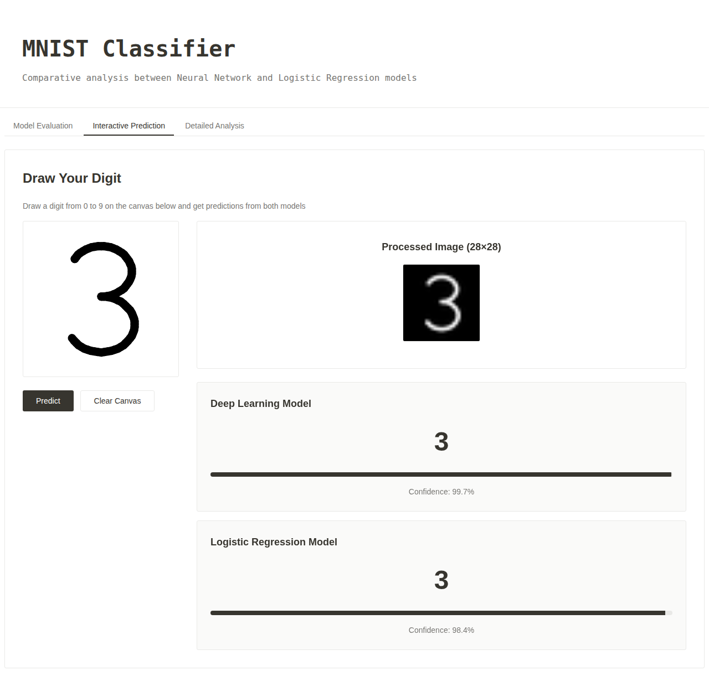

# MNIST Classifier

Compares a **logistic regression** model with a small **neural network** (MLP) on handwritten digits from MNIST. A web dashboard shows the evaluation metrics and lets you draw a digit to see what each model predicts.



| Model               | Test accuracy |
|---------------------|---------------|
| Logistic Regression | ~92.6%        |
| Neural Network      | ~97.5%        |

## Usage

Install the dependencies:

```bash
pip install -r requirements.txt
```

Train both models. This saves them to `models/` and their predictions to `results/`:

```bash
mkdir -p models results && python train.py
```

Start the app, then open http://localhost:5000:

```bash
python app/app.py
```

## Dashboard

- **Model Evaluation**: accuracy, precision, recall, F1, and confusion matrices
- **Interactive Prediction**: draw a digit and compare both models' predictions
- **Detailed Analysis**: per-class metrics

## Structure

```
train.py          # trains and saves both models
app/app.py        # Flask backend (API + serves the page)
app/utils.py      # metrics, plots, drawing preprocessing
app/index.html    # frontend
data/download.py  # optional: export MNIST as PNG images
```
